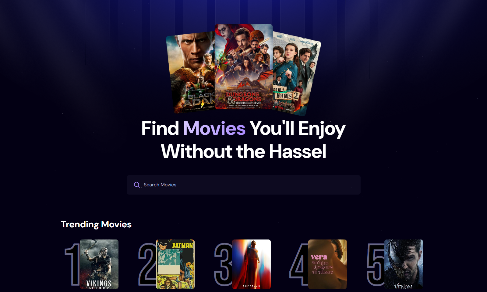

# 🎬 React Movie Explorer

A responsive movie explorer app built with **React** and **Tailwind CSS**, using **The Movie Database (TMDB) API**.  
It shows trending movies, allows users to search for movies by title, and displays key movie details.

🔗 **Live Demo:** [https://react-movie-explorer-nu.vercel.app](https://react-movie-explorer-nu.vercel.app)

## 📸 Screenshots

### 🏠 Home Page - Trending Movies

---

## 🚀 Features

- 🔥 Trending Movies section
- 🔍 Search for any movie using TMDB
- 📱 Fully responsive UI with Tailwind CSS
- 🌙 Clean and minimal design

---

## 🛠 Tech Stack

- **React** – UI library for building interactive UIs
- **Tailwind CSS** – Utility-first CSS framework for styling
- **Vite** – Fast front-end build tool
- **TMDB API** – Movie data source (trending, search, details)
- **Appwrite** – Backend server for storing/searching movie data
- **Deployment** – Vercel (instant CI/CD & hosting)
